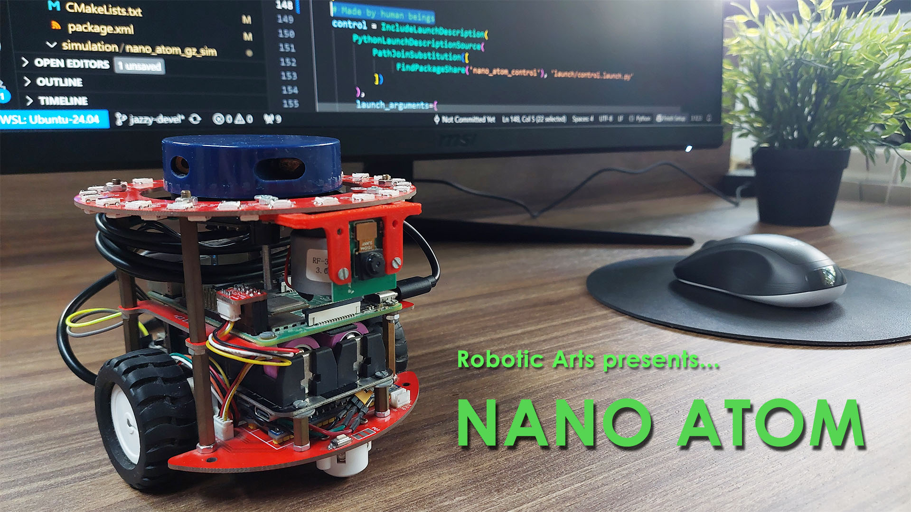
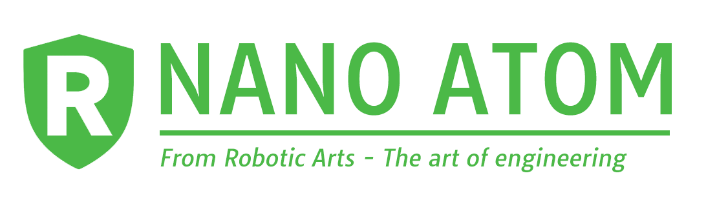
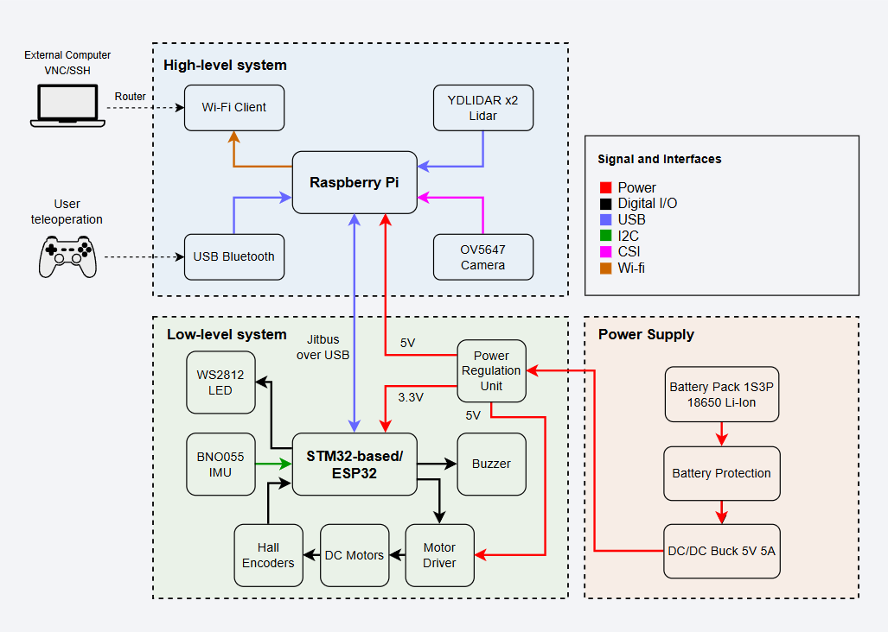
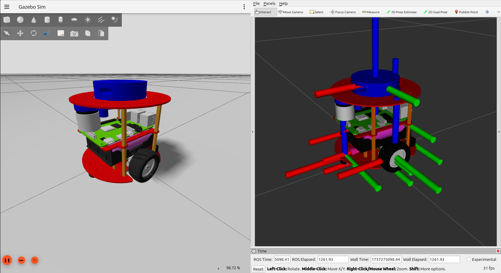
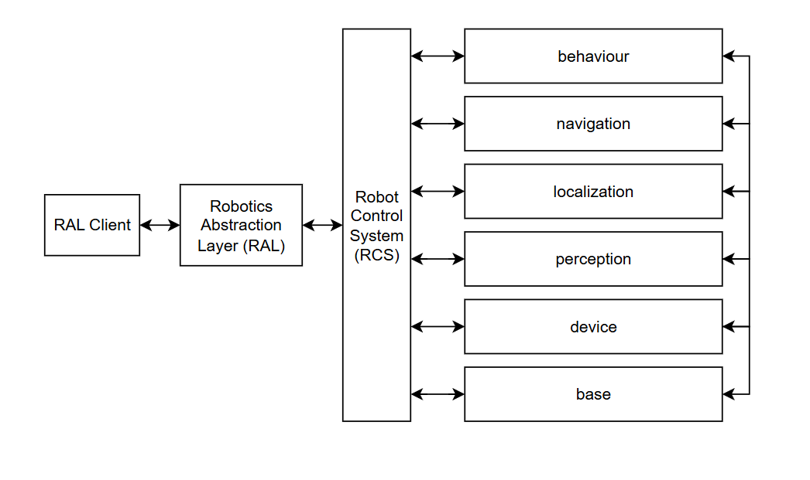
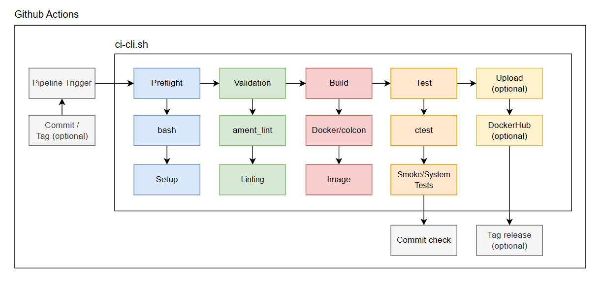

 [](https://github.com/RoboticArts/nano_atom/actions/workflows/ci.yaml) 


# Meet Nano Atom!

<p align="center">

</p>


## 1. Overview

### 1.1 Introduction

Nano Atom is an open-source mobile robot designed to emulate professional ROS robots at desktop scale, helping educators prepare students for future careers in robotics.

<p align="center">

</p>

Its mission is to make robotics more accessible to students, makers, and enthusiasts by offering a robot that is:

- **Affordable and accessible**, so more people can own a physical robot instead of relying only on simulation.
- **Professional-grade in miniature**, with sensors and architecture similar to commercial robots, but adapted to a desktop format.
- **Open source and modular**, allowing anyone to study its design, replicate it, modify it, and adapt it to their own interests.
- **Focused on hands-on learning**, clearly showing how hardware, software, control, simulation, and deployment come together in a real robotics project.

### 1.2 Specifications

Nano Atom packs the essential features of a ROS robot into a compact and affordable desktop format. The following specifications summarize its hardware and software capabilities.

- **Dimensions:** 11.5 × 11.5 × 11.5 cm  
- **Weight:** 350 g  
- **Onboard Computer:** Raspberry Pi 4 (4 GB RAM)  
- **LiDAR:** YDLIDAR X2 (360°, 8 m range)  
- **Camera:** OV5647 (5 MP, 1080p @ 30 fps)  
- **IMU:** Bosch BNO055 (9-axis sensor fusion)  
- **Wheel Encoders:** Quadrature Hall effect  
- **Maximum Speed:** 0.17 m/s  
- **Battery Life:** 2.5 – 4 h (≈2.5 h recharge time)  
- **Connectivity:** Wi-Fi, USB 3.0/2.0, GPIO  
- **Power Supply:** 5 V, 5000 mAh (regulated output)
- **Software:** ROS 2


### 1.3 Electronic System

See `hardware/electronics` for BOM and schematics.

<p align="center">

</p>


## 2. Quick start

*Requirements: Linux/WSL2, Docker v2.x and X11*

<p align="center">

</p>


### 2.1 Run Nano Atom

Get the docker compose file:

```
wget https://raw.githubusercontent.com/RoboticArts/nano_atom/refs/heads/jazzy-devel/docker/docker-compose.yaml
```

Enable GUI access for Docker:

```
xhost +local:root
```
**Note**: `xhost` temporarily enables GUI access in the current X11 session (Linux). You can revoke it anytime with `xhost -local:root`. Users on WSL2 can ignore it.

Run simulation:
```
docker compose up --pull alway
```

### 2.2 Control Nano Atom

Open a new terminal and run teleop node:

```
docker exec -it nano-atom bash -ic "ros2 run teleop_twist_keyboard teleop_twist_keyboard --ros-args --remap cmd_vel:=/robot/robot_base_controller/cmd_vel -p stamped:=true"
```

## 3. Installation

### 3.1. Setup

Create the workspace:

```
mkdir -p ~/ros2_ws/src && cd ~/ros2_ws/src
```

Clone the repository:

```
git clone --branch jazzy-devel https://github.com/RoboticArts/nano_atom.git
```

### Option 1. Build from ROS2

Install dependencies:

```
cd ~/ros2_ws
rosdep update && rosdep install --from-paths src --ignore-src -y -r --rosdistro jazzy
```

Build the repository:

```
colcon build --symlink-install
source install/setup.bash
```

### Option 2. Build from Docker

Install CycloneDDS:

```
sudo apt-get update && sudo apt-get install ros-jazzy-rmw-cyclonedds-cpp
```

Build the docker image:

```
cd ~/ros2_ws/src/nano_atom
docker compose -f docker/docker-compose.build.yaml build
```

<!-- docker build -t nano-atom:build -f docker/Dockerfile . --> 

## 4. Bringup

### 4.1. Setup

Go to the repository root directory:

```
cd ~/ros2_ws/src/nano_atom
```


### Option 1. ROS2 launch

Run `nano_atom` packages:

```
ros2 launch nano_atom_base base.launch.py
```

### Option 2. Docker container

Run `nano atom` containers:

```
docker compose -f docker/docker-compose.build.yaml up
```

To access ROS 2 topics from your host, set CycloneDDS as the middleware:

```
export RMW_IMPLEMENTATION=rmw_cyclonedds_cpp
ros2 topic list
```

## 5. Development

### 5.1 Docker container

The `docker-compose.dev.yaml` uses `docker-compose.yaml` to load the host repository as a volume
and source the workspace. 

Go to the repository root directory:

```
cd ~/ros2_ws/src/nano_atom
```


Build docker (if needed):

```
docker compose -f docker/docker-compose.dev.yaml build
```

Start docker containers:

```
docker compose -f docker/docker-compose.dev.yaml up
```

Go inside the container:

```
docker exec -it nano-atom bash
```


## 6. Architecture

This section details the **planned** architecture of the `nano_atom` robot from the perspective of robotics development, acting as the backend for high-level applications.

<p align="center">

</p>

The software is arranged in different `modules`, each designed to accomplish a specific set of tasks. For example, localization focuses on guaranteeing the robot’s pose within an environment, while navigation provides a trajectory path.

The `modules` are based on a decoupled architecture, where communication between modules is allowed, but only through restrictive policies and standard interfaces. Together, they form the operative software (p.e. real time, control, etc), but they do not make decisions.

The `Robot Control System (RCS)` is responsible for decision-making, orchestrating and controlling each module. Its purpose is to translate high-level commands into concrete tasks for the modules.

The `Robotics Abstraction Layer (RAL)` provides a specification and a library that abstracts the logic of the `RCS` into standard commands using sockets. This ensures that user applications remain unchanged even if the internal logic evolves. 

The `RAL Client` provides access to the `RAL` interface in a specific programming language. With this design, developers do not need access to the library’s source code to execute commands on the robot, as all interactions are handled through the RAL Client via sockets.

## 7. CI Pipeline

The pipeline of this repository ensures that every commit triggers a clean build from scratch and runs the test suite to verify the changes. When a new version is tagged, the pipeline builds and publishes a Docker image to DockerHub.

The following diagram shows the CI architecture. For the technical implementation, see the `.github` and `scripts/ci` directories.

<p align="center">

</p>

The CI pipeline is implemented using a GitHub Actions workflow, which orchestrates each stage through the `ci-cli` utility to manage the diferent pipeline phases.

Each step of the workflow calls `ci-cli --command <command>` to run these stages:

- **prefligh:** Ensures that files and directories are correctly structured before starting the CI process.
- **validation:** Runs static code analysis and linting checks.
- **build:** Uses a clean ROS Docker image to install and compile the ROS packages. The result is stored as a build artifact (Docker image).
- **test:** Executes the test suite on the generated artifact.
- **upload:** Pushes the Docker image to DockerHub, which serves as the staging area.

This architecture allows the `ci-cli` utility to be used seamlessly both locally and within the CI workflow. For example, running tests locally can be done with:

```
cd ~/ros2_ws/src/nano_atom
./scripts/ci/ci-cli.sh --command test
```

